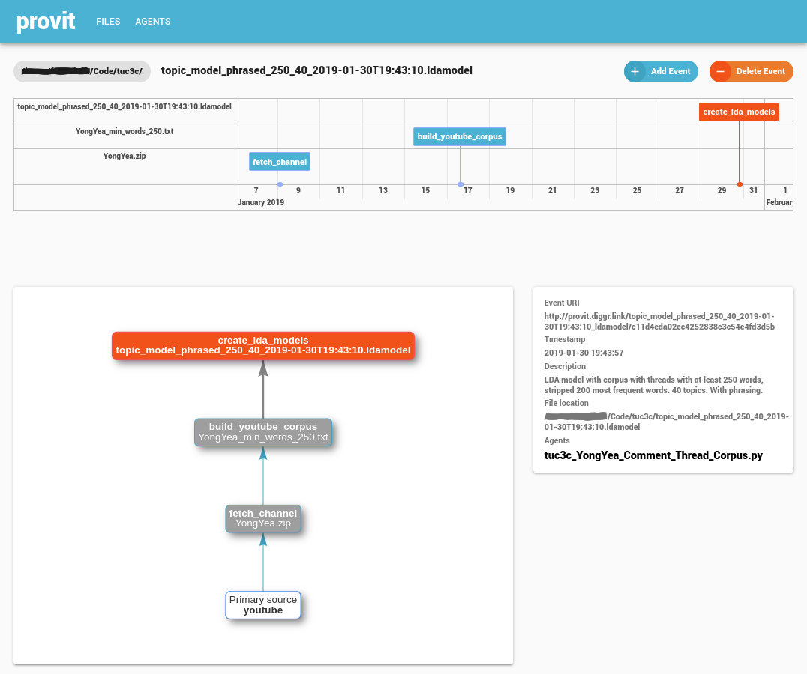
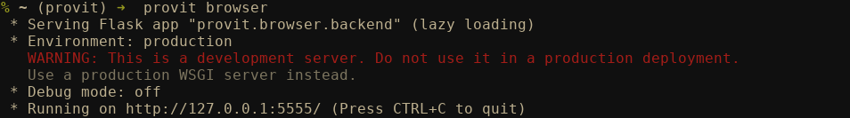
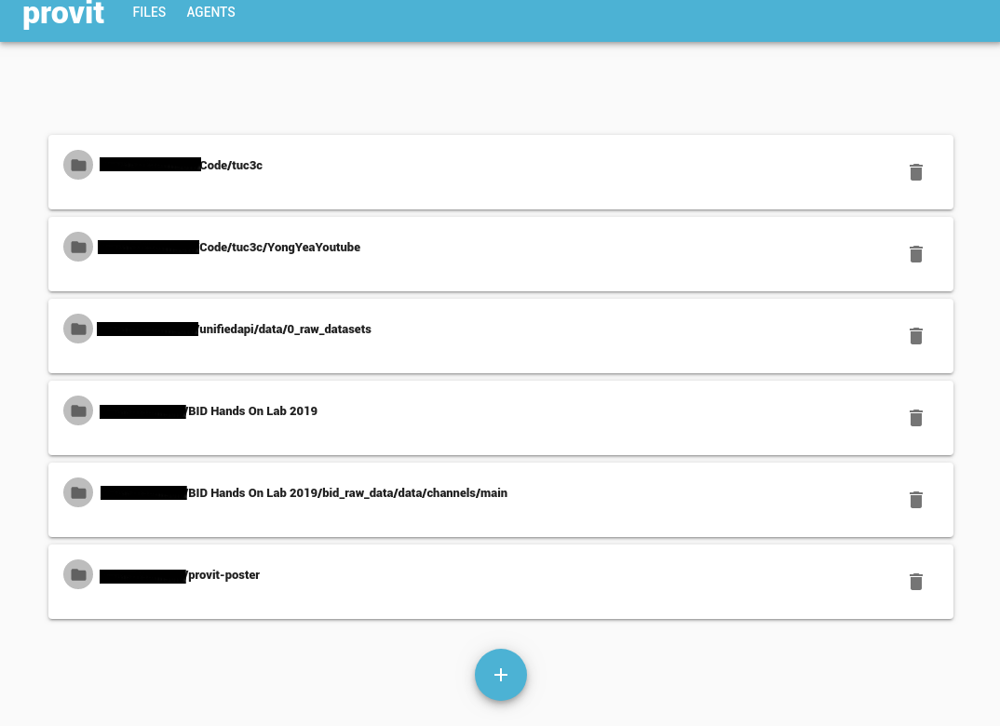

provit browser
==============

*provit browser* is the graphical user interface of provit. It can be used to track provenance, as well as intuitive interface to explore existing provenance.

If a data file, is selected in the browser a detail view of the accompanied provenance file is opened. It consinsts of a timeline, a provenance graph, and a detail window, where additional information about the currently selected node in the provenance file is displayed.

Start
-----

You start the *provit browser* by simply invoking this in your terminal. 

.. warning::

The warning can safely be ignored, as the server will only be started on your machine.

Usage
-----

After starting *provit browser* you are displayed all your data directories. 

New directories can be added by using the plus sign at the bottom of the page.

By clicking on a directory, the contents of the directory are displayed. All files without provenance information have a red background. Inspectable/Explorable files are displayed with a white background.

Clicking on a file with disply the detailed provenance information of the file as shown above.

